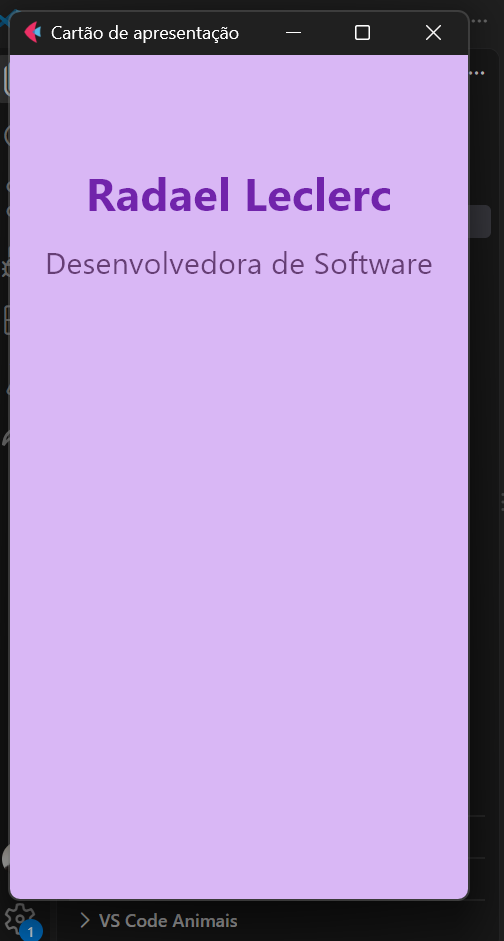
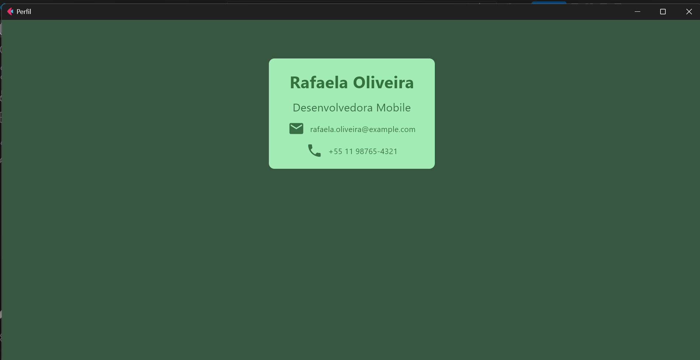
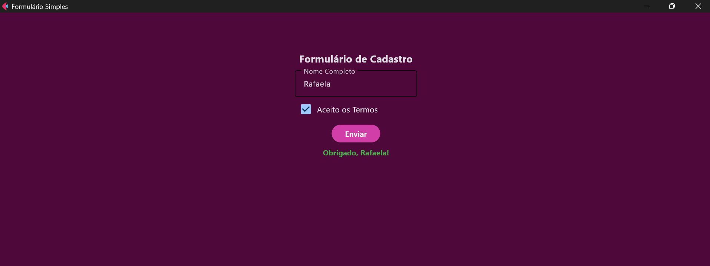
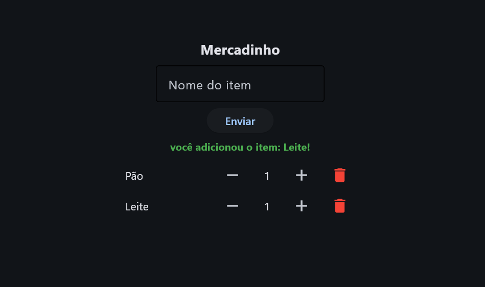

# Atividades em Python com Flet

---

# Índice

---

## Sobre o Projeto

Este projeto reúne uma sequência de atividades práticas desenvolvidas utilizando **Python** e o framework **Flet** para criação de interfaces gráficas.

As atividades foram elaboradas com o objetivo de praticar conceitos fundamentais de desenvolvimento de aplicações com interface visual, incluindo criação de componentes, organização de layouts, entrada de dados, eventos, validações, atualização da interface e manipulação de informações.

Ao longo das atividades, foram desenvolvidas diferentes aplicações:

- Cartão de apresentação;
- Perfil profissional;
- Formulário de cadastro;
- Mercadinho com controle de quantidade e remoção de produtos.

Cada exercício apresenta uma proposta diferente e contribui para a evolução dos conhecimentos relacionados ao desenvolvimento de interfaces utilizando Python.

---

## Objetivo

O principal objetivo das atividades é colocar em prática os conceitos de desenvolvimento de interfaces gráficas utilizando **Flet**.

Durante o desenvolvimento foram trabalhados conceitos como:

- Criação de páginas;
- Definição de títulos e cores;
- Organização de componentes;
- Criação de formulários;
- Entrada de informações pelo usuário;
- Botões e eventos de clique;
- Validação de campos;
- Exibição de mensagens;
- Atualização dinâmica da interface;
- Manipulação de listas;
- Controle de quantidade;
- Remoção de elementos;
- Organização de layouts;
- Utilização de componentes visuais.

---

# Atividade 1 — Cartão de Apresentação

A primeira atividade consiste na criação de um **cartão de apresentação** utilizando Flet.

A aplicação apresenta uma interface simples contendo o nome e a profissão da pessoa.

O projeto utiliza uma janela vertical com fundo em tom de lilás e textos centralizados.

### Informações apresentadas

- Nome: **Radael Leclerc**
- Profissão: **Desenvolvedora de Software**

### Características da interface

- Fundo lilás;
- Nome em destaque;
- Texto centralizado;
- Fonte em tamanho maior para o nome;
- Nome utilizando negrito;
- Janela configurada para formato vertical;
- Alinhamento central dos elementos.

### Código utilizado

O arquivo `atv1.py` utiliza o Flet para criar a página e adicionar os elementos de texto.

A página recebe o título **"Cartão de apresentação"**, além de configurações de alinhamento, cor de fundo, tamanho da janela e espaçamento. 

A aplicação utiliza componentes `Text` para apresentar o nome e a profissão. 

### Resultado

  

**Cartão de apresentação desenvolvido com Python e Flet.**

---

# Atividade 2 — Perfil

A segunda atividade apresenta um **perfil profissional** utilizando uma estrutura baseada em cartões.

A interface utiliza um fundo verde escuro e um `Container` central com informações profissionais.

### Informações apresentadas

- Nome: **Rafaela Oliveira**
- Cargo: **Desenvolvedora Mobile**
- E-mail: **rafaela.oliveira@example.com**
- Telefone: **+55 11 98765-4321**

### Características da interface

O perfil possui:

- Cartão centralizado;
- Fundo verde escuro;
- Fundo verde claro no cartão;
- Nome em destaque;
- Cargo profissional;
- Ícone de e-mail;
- Endereço de e-mail;
- Ícone de telefone;
- Número de telefone;
- Bordas arredondadas;
- Organização dos dados em linhas.

### Organização do código

O arquivo `atv2.py` utiliza:

- `Container`;
- `Column`;
- `Row`;
- `Text`;
- `Icon`.

O `Container` funciona como o cartão principal da interface, enquanto as `Rows` são utilizadas para organizar os dados de contato.

Os ícones de e-mail e telefone são inseridos utilizando os componentes de ícones do Flet.

### Resultado

  

**Perfil profissional desenvolvido com Python e Flet.**

---

# Atividade 3 — Formulário de Cadastro

A terceira atividade consiste na criação de um **formulário simples de cadastro**.

A aplicação permite que o usuário informe seu nome, aceite os termos e envie as informações.

Após o envio, o sistema apresenta uma mensagem personalizada utilizando o nome informado.

### Componentes utilizados

O formulário possui:

- Campo de nome completo;
- Checkbox de aceite dos termos;
- Botão de envio;
- Mensagem de resultado.

### Campo de entrada

Foi utilizado o componente:

python
ft.TextField()

O campo permite que o usuário informe seu nome.

Validação

O sistema verifica se o usuário informou um nome antes de enviar o formulário.

Caso o campo esteja vazio, uma mensagem de erro é apresentada:

Por favor, digite seu nome

Quando o nome é preenchido corretamente, a aplicação apresenta uma mensagem personalizada.

Exemplo:

Obrigado, Rafaela!
Funcionamento

O botão Enviar possui uma função responsável por processar o formulário.

O funcionamento ocorre da seguinte maneira:

O usuário informa o nome;

O sistema verifica se o campo está preenchido;

Caso esteja vazio, apresenta uma mensagem de erro;

Caso esteja preenchido, captura o nome;

A mensagem de resultado é atualizada;

A interface é atualizada.

### Resultado da Atividade

  

# Atividade 4 — Mercadinho

A quarta atividade apresenta uma aplicação de lista de compras, simulando um pequeno mercadinho.

Nesta atividade foi trabalhada uma interface mais interativa, permitindo que o usuário adicione produtos, altere suas quantidades e remova itens da lista.

### Funcionalidades

A aplicação permite:

Digitar o nome de um produto;
Adicionar o produto à lista;
Exibir uma mensagem de confirmação;
Aumentar a quantidade;
Diminuir a quantidade;
Remover produtos;
Limpar o campo após o cadastro;
Validar o preenchimento do campo.
Cadastro de produtos

O usuário informa o nome do produto no campo:

Nome do item

Após clicar em Enviar, o produto é adicionado à lista.

Exemplo:

você adicionou o item: Leite!
Controle de quantidade

Cada produto adicionado começa com a quantidade:

1

O usuário pode aumentar ou diminuir a quantidade utilizando os botões:

-
+

A quantidade não pode ser reduzida para um valor menor que 1.

Remoção de produtos

Cada produto possui um botão de lixeira.

Ao clicar no botão, o item correspondente é removido da lista.

O sistema utiliza a manipulação dos controles da lista para realizar a remoção do produto.

Validação

Caso o usuário tente adicionar um produto sem preencher o campo, o sistema apresenta uma mensagem de erro:

Por favor, digite seu item

Após o cadastro de um produto, o campo de entrada é automaticamente limpo.

Estrutura de cada produto

Cada item é organizado horizontalmente contendo:

Nome do produto;

Botão para diminuir;

Quantidade;

Botão para aumentar;

Botão para excluir.

Resultado da Atividade

  

### Tecnologias Utilizadas

## Python

A linguagem Python foi utilizada como base para o desenvolvimento das quatro atividades.

Por meio da linguagem foram implementados:

Variáveis;

Funções;

Condições;

Estruturas de controle;

Manipulação de dados;

Eventos;

Validações;

Atualização da interface.

## Flet

O Flet foi utilizado para desenvolver as interfaces gráficas das atividades.

Entre os componentes utilizados estão:

Page;

Text;

TextField;

Button;

Checkbox;

Container;

Column;

Row;

Icon;

IconButton.

## Conceitos Aplicados

Interface Gráfica

As atividades utilizam componentes visuais para criar aplicações interativas.

Os elementos são organizados dentro de páginas e containers, permitindo a criação de diferentes layouts.

## Layout

Foram utilizados componentes como:

Column

Row

Container

O Column permite organizar elementos verticalmente.

O Row permite organizar elementos horizontalmente.

O Container permite criar áreas específicas para agrupamento e estilização de componentes.

## Eventos

Os botões das aplicações utilizam eventos de clique para executar funções.

Exemplo:

on_click=enviar_formulario

Quando o usuário clica no botão, a função correspondente é executada.

## Validação

Os formulários possuem verificações para impedir que informações obrigatórias sejam enviadas vazias.

Na atividade do formulário, por exemplo, o sistema verifica se o nome foi informado.

No Mercadinho, o sistema verifica se o nome do produto foi preenchido antes de adicioná-lo à lista.

## Atualização Dinâmica

O método:

page.update()

é utilizado para atualizar a interface depois que alguma informação é alterada.

Esse recurso é importante principalmente nas atividades interativas.

## Manipulação de Listas

Na atividade do Mercadinho, os produtos são adicionados dinamicamente a uma lista de controles.

A lista pode receber novos elementos e também remover elementos existentes.

## Controle de Estado

O Mercadinho utiliza uma variável para controlar a quantidade de cada produto.

Quando o usuário clica nos botões de aumentar ou diminuir, o valor é atualizado e a interface é modificada.

## Componentes Utilizados

Page

Responsável pela configuração principal da aplicação.

Pode ser utilizado para definir:

Título da janela;

Tamanho;

Cor de fundo;

Alinhamento;

Espaçamento;

Componentes da página.

Text

Utilizado para apresentar informações textuais.

Exemplo:

ft.Text("Rafaela Oliveira")
TextField

Utilizado para receber informações digitadas pelo usuário.

Foi utilizado principalmente nas atividades de:

Formulário de cadastro;

Mercadinho.

Button

Utilizado para executar ações por meio de cliques.

Exemplo:

ft.Button(
    content="Enviar",
    on_click=enviar_formulario
)
Checkbox

Utilizado no formulário de cadastro para representar o aceite dos termos.

Exemplo:

ft.Checkbox(
    label="Aceito os Termos"
)
Container

Utilizado para criar áreas organizadas dentro da interface.

Na atividade de perfil, o Container é utilizado para criar o cartão central contendo as informações profissionais.

Row

Utilizado para organizar componentes horizontalmente.

Na atividade do Mercadinho, cada produto é representado por uma Row.

Column

Utilizado para organizar componentes verticalmente.

As atividades utilizam Column para estruturar os principais elementos da página.

Icon

Utilizado para apresentar ícones visuais.

Na atividade de perfil, são utilizados ícones para representar:

E-mail;

Telefone.

IconButton

Utilizado para criar botões representados por ícones.

No Mercadinho, os IconButton são utilizados para:

Diminuir quantidade;

Aumentar quantidade;

Excluir produtos.

# Aprendizados

O desenvolvimento das atividades possibilitou praticar conceitos importantes de programação e 
desenvolvimento de interfaces.

Entre os principais aprendizados estão:

Criação de interfaces gráficas com Python;

Utilização do framework Flet;

Organização de componentes;

Criação de layouts;

Desenvolvimento de formulários;

Validação de informações;

Criação de eventos;

Atualização de componentes;

Manipulação de listas;

Controle de quantidade;

Remoção dinâmica de elementos;

Organização de arquivos Python.

A sequência das atividades também permitiu compreender como uma aplicação pode evoluir de uma interface 
simples para um sistema interativo com diferentes funcionalidades.

# Autoria

**Rafaela Oliveira**

Estudante de Desenvolvimento de Sistemas

<strong>Atividades de Python com Flet</strong>

 

Desenvolvimento de Sistemas — SENAI

